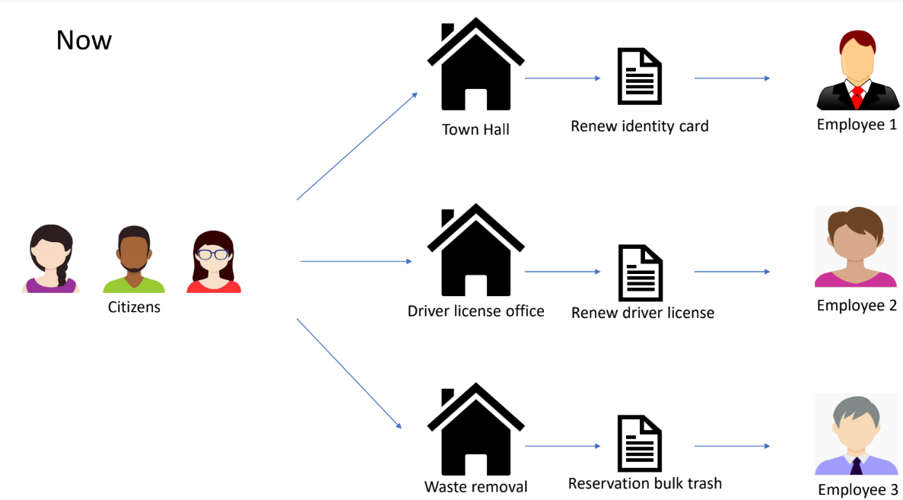
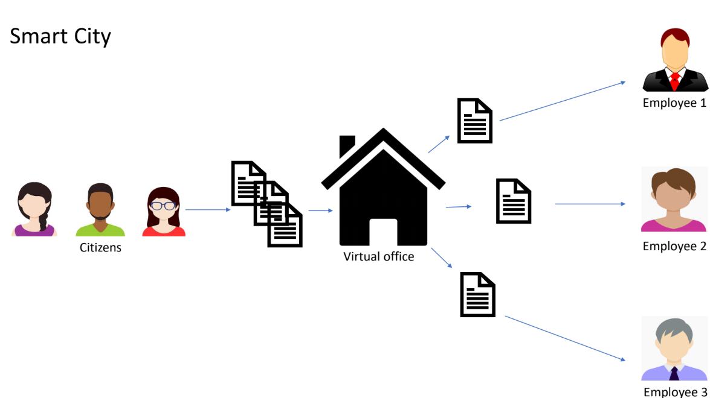
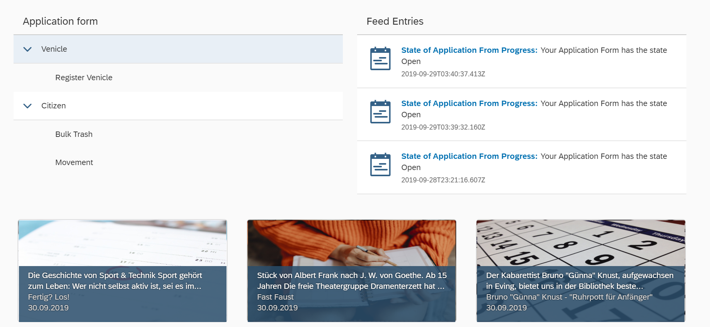
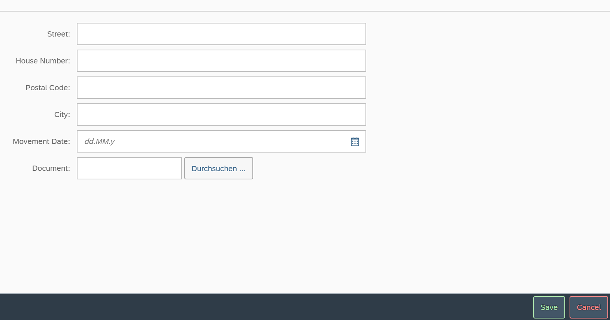
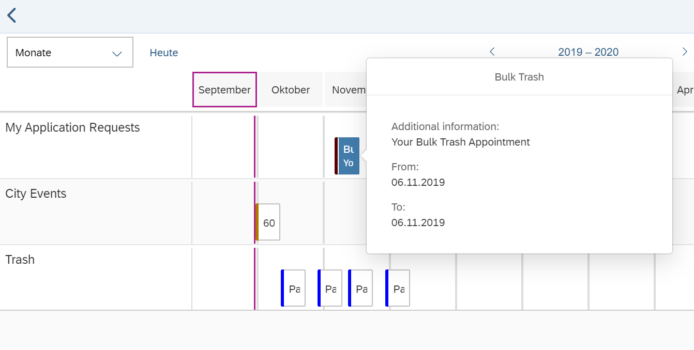

# Template Repository
This is a template, please fill it with your teams data. Places to fill in data are marked with a //TODO. If you fail to do so, our jury can't evaluate your project. 

## Description 
MySmartCityApp is a framework for approval forms and all about this.

**Features**
* Dynamic layout for forms
* Dynamic Validations
* Status management of approval forms
* FileUpload
* Calendar entrys of important information

## Built with
**Database**
* MongoDB V4.0.9(Community)

**Server**
* Node.js V11.6.0
* Express V4.17.1
* TypeScript V3.5.2

**WebApp**
* SAP UI5 V1.52.5

**IDE**
* Visual Studio Code

## What benefit will your work bring in smart city context?

### Now:

Citizens have to go to different offices for their form e.g. Renew driver license -> Driver license office or Renew identity card -> Town Hall.

Each office has its own opening hours and this is very complicated for citizens.

### SmartCity:

In a SmartCityworld there is only one virtual office left!.
This office has all the forms of the city.

A citizen fills an application form and the respective employee of the city works on this.
The citizen knows through the app the dates and the status

## What were challenges you encountered and Lessons Learned?
#### Problems with the frontend development
* Problem: UI5 is complicatad in some place
* Solution: Workaround in some situation e.g. not elegant development

#### Problems with the backend development
* Problem: New requirements in the middle and the end of the project
* Solution: Rebuild and restructure the code

## About your team

### **Team RKU**

**Team Captain Tim Ittermann**
 * Age: 23 years old
 * Living place: Herne⋅
 * Employer: [Rku.It](http://www.rku-it.de)/Herne
 * Position: Dual Student Software Engineering at FH Dortmund
 * Development experience: Java/TypeScript/React/C#

**Team Assistant Sven Treutler**
 * Age: 30 years old
 * Living place: Herne
 * Employer: [Rku.It](http://www.rku-it.de)/Herne
 * Position: Senior Developer 
 * Development experience: Java/ABAP/UI5

## What's next for your project?

**Important things to do**
* User Experience
* Error Tolerance
* Performance
* User Management
* Logging
* Admin App
* Employee App

## How does it look?
Startpage

Application forms

Calendar

## Anything to add?
Many thanks to the organization of the DO!Hack 2019. Super Job. We love it!

